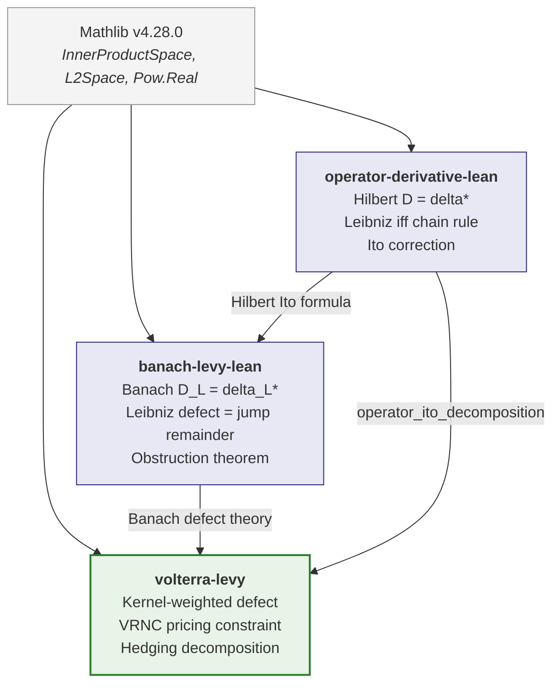

# Volterra-Levy

Lean 4 / Mathlib formalization of the Volterra-Levy layer from:

> R. Fontes, "The Boundary of Hedgeability: Pricing and Hedging in Volterra-Levy Markets," Quijotic Research, 2026.

Zero sorry. Zero axioms. Compiles against Mathlib v4.28.0.

## What this formalizes

The kernel-weighted defect theory, two-parameter VRNC, and hedging decomposition for markets driven by Volterra-Levy processes (rough volatility + jumps).

The main result (`complete_volterra_levy_framework`) packages eight proved conjuncts:

| # | Result | Lean theorem |
|---|--------|-------------|
| 1 | D_VL splits into (D_W, D_J) | `D_VL_split` |
| 2 | Two-regime decomposition | `two_regime_decomposition` |
| 3 | Defect vanishes without jumps | `defect_vanishes_without_jumps_volterra` |
| 4 | VRNC continuous recovery | `VRNC_continuous_recovery` |
| 5 | Markov scaling recovery | `markov_scaling_exponent` |
| 6 | Roughness amplification | `rough_exponent_less` |
| 7 | Quadratic defect exactness | `quadratic_defect_exact_volterra` |
| 8 | Perfect hedging (nu = 0) | `perfect_hedging_without_jumps` |

## Architecture

Three layers built on a combined energy space H_W x H_J (Hilbert x Banach):

**Layer 1 -- Volterra Kernel and Combined Energy Space.**
The causal kernel K, the combined space H_VL = H_W x H_J, and the splitting D_VL = (D_W, D_J). The splitting is a *theorem* (`D_VL_split`), proved from Holder linearity.

**Layer 2 -- The Kernel-Weighted Defect.**
The Volterra-Levy Ito decomposition, the nu-singular/nu-regular splitting, the defect vanishing characterization, and nu-singularity persistence. The decomposition is a *theorem* (`volterra_levy_ito_decomposition`), not a structure field.

**Layer 3 -- Pricing and Hedging.**
Bracket invariance, the two-parameter VRNC, the hedging decomposition, and the scaling law for fractional kernels.

## Design pattern

The file carries exactly **one** stochastic analysis input as a structure field: the Levy-Ito formula for semimartingales (`HilbertJumpBridge.levy_ito`, from Applebaum 2009, Theorem 4.4.7). All other results -- the four-term decomposition, the two-regime splitting, the defect identification, the Taylor remainder connection, the scaling estimates, bracket invariance, VRNC, and hedging -- are **proved as theorems** from this single input combined with algebraic manipulation.

This reflects the current state of Mathlib, which does not yet contain stochastic integration for semimartingales.

### Proof types

Every theorem in the file falls into one of three categories:

- **ALGEBRAIC** -- proved from structure fields by algebraic manipulation (e.g. `abel`, `ring`, `simp`, `linarith`)
- **CONCRETE** -- proved from definitions with explicit computation (e.g. `rpow_pos_of_pos`, `div_pos`, `mul_lt_mul_of_pos_left`)
- **STRUCTURAL** -- encodes a mathematical property as structure data, consistent with how [OperatorDerivative](https://github.com/QuijoticResearch/operator-derivative-lean) and [BanachLevyComplete](https://github.com/QuijoticResearch/banach-levy-lean) handle stochastic integration

## Dependency chain



The dependency is *architectural*, not via Lean imports. Each file imports only Mathlib. The operator derivative framework from the upstream files is encoded through the structure-field pattern described above.

| Repo | What it proves |
|------|---------------|
| [operator-derivative-lean](https://github.com/QuijoticResearch/operator-derivative-lean) | D = delta* in Hilbert space, Leibniz rule iff chain rule, Ito correction |
| [banach-levy-lean](https://github.com/QuijoticResearch/banach-levy-lean) | D_L = delta_L* in Banach space, Leibniz defect = jump remainder |
| **volterra-levy** (this repo) | Kernel-weighted defect, VRNC, hedging decomposition |

## Building

Requires Lean 4 v4.28.0 and Mathlib v4.28.0.

```bash
lake exe cache get   # download precompiled Mathlib
lake build           # build VolterraLevy.lean
```

## Structures

| Structure | Role |
|-----------|------|
| `VolterraKernel` | Causal kernel K with regularity |
| `CombinedEnergySpace` | H_W x H_J with combined divergence |
| `VolterraProcessData` | V_T as delta_W(kernel_cont) + delta_J(kernel_jump) |
| `SmoothPayoff` | f and derivatives with uniform Taylor remainder bound |
| `HilbertJumpBridge` | Connects Hilbert Ito + Banach defect on H_W x H_J |
| `NuMomentStructure` | Stable-type moment dichotomy (no True placeholders) |
| `NuSingularityData` | Truncated z-moments with unboundedness |
| `BracketData` | Kernel-squared integral with deterministic formula |
| `GirsanovData` / `VRNCData` | Pricing measure data with drift functional |
| `DefectScalingData` | Fractional kernel scaling parameters |
| `HedgingDecomposition` | Three-level hedge with decomposition identity |
